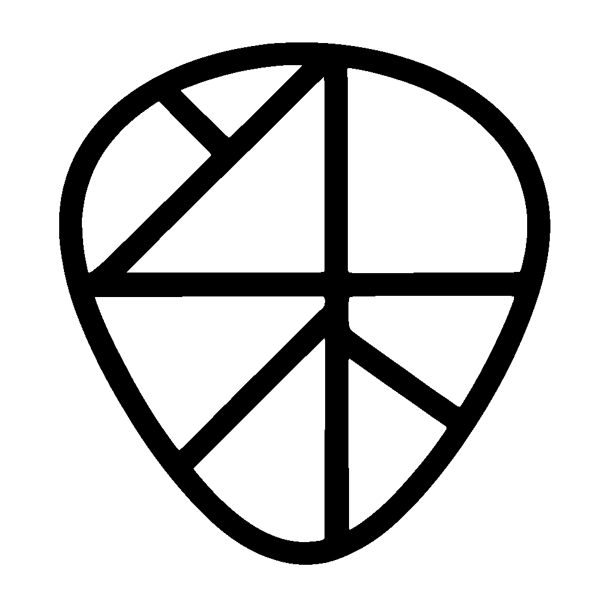
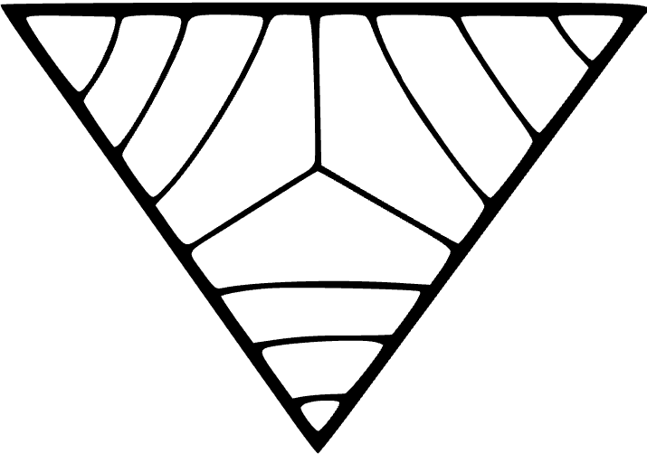

  <picture>
    <source srcset="./assets/robles-inverted-transparent.png" media="(prefers-color-scheme: dark)">
    
  </picture>

 

> Robles is Ramate LLC's implementation of OAC protocols.

<h1>
  <picture>
    <source srcset="./assets/ramate-inverted-transparent.png" media="(prefers-color-scheme: dark)">
    
  </picture>
  <picture>
    <source srcset="./assets/oac-inverted-transparent.png" media="(prefers-color-scheme: dark)">
    
  </picture>
  <picture>
    <source srcset="./assets/robles-inverted-transparent.png" media="(prefers-color-scheme: dark)">
    
  </picture>
  Robles
</h1>

Robles is [Ramate LLC's](https://www.ramate.io) implementation of [OAC](https://github.com/ramate-io/oac).

   
  <picture>
    <source srcset="./assets/robles-stack-inverted-transparent.png" media="(prefers-color-scheme: dark)">
    
  </picture>

 

Robles currently consists of the foundational implementations anticipated by [OROAD-0](https://github.com/ramate-io/oac/blob/main/oroad/oera-000-000-000-dulan/oroad-000-000-000/README.md):

- **[`gwrdfa`](https://github.com/ramate-io/gwrdfa):** an implementation of **[ROART-1: BFA](https://github.com/ramate-io/oac/blob/main/roart/roera-000-000-000-dulan/roart-000-000-001-bfa/README.md)** protocol substack. This forms the basis for high-throughput and large footprint OAC applications.
- **[`srcavei`](https://github.com/ramate-io/srcavei):** an implementation of the **[ROART-2: Collaborative Transaction Routing](https://github.com/ramate-io/oac/blob/main/roart/roera-000-000-000-dulan/roart-000-000-002-ctr/README.md)** substack. This forms the basis for incentivization—which would no longer be strictly coin-based.
- **[`fuste`](https://github.com/ramate-io/fuste):** a RISC-V VM with a set of adapters tailored to DLT—particularly plugging into the stack above. This is also critical to throughput and large footprint.
- **[`zhiye`](https://github.com/ramate-io/zhiye):** implementation of **[ROART-3: RIS-STM](https://github.com/ramate-io/oac/blob/main/roart/roera-000-000-000-dulan/roart-000-000-003-ris-stm/README.md)**. This takes advantage of some properties of BFA to greatly reduce best-case latency.

## Contributing

| Task | Description |
|------|-------------|
| [Upcoming Events](https://github.com/ramate-io/robles/issues?q=is%3Aissue%20state%3Aopen%20label%3Apriority%3Ahigh%2Cpriority%3Amedium%20label%3Aevent) | High-priority `event` issues with planned completion dates. |
| [Release Candidates](https://github.com/ramate-io/robles/issues?q=is%3Aissue%20state%3Aopen%20label%3Arelease-candidate) | Feature-complete versions linked to events. |
| [Features & Bugs](https://github.com/ramate-io/robles/issues?q=is%3Aissue%20state%3Aopen%20label%3Afeature%2Cbug%20label%3Apriority%3Aurgent%2Cpriority%3Ahigh) | High-priority `feature` and `bug` issues. |

Please see [CONTRIBUTING.md](CONTRIBUTING.md) file for additional contribution guidelines.

## Organization

### Artifacts
Under [ROGLO-0](./roglo/roera-000-000-000-dulan/roglo-000-000-000-artifact/README.md), this subsection defines the recognized artifact types. We recognize the following types:
- [`roera`](./roera): Robles Eras (ROERA) are the periods over which a governing body makes decisions. All other Robles [Artifacts](./roglo/roera-000-000-000-dulan/roglo-000-000-000-artifact/README.md) are indexed by ROERA.
- [`roglo`](./roglo/): Robles Glosses (ROGLO) are defined terms for Robles.
- [`roproc`](./opurp/): Robles Proclamations (ROPROC) are statements of purpose for Robles.
- [`rogov`](./rogov/): Robles Governance (ROGOV) are constitutions of, procedures for, and interpretations of Robles governance.
- [`roleg`](./roleg/): Robles Legal Documents (ROLEG) are published legal documents covering Robles operations in any jurisdiction.
- [`rocert`](./rocert/): Robles Certificates (ROCERT) certify a given project as abiding by the Robles paradigm.
- [`rode`](./rode/): Robles Desiderata (RODE) describe wants, open problems, and similar within the Robles paradigm.
- [`rospec`](./rospec): Robles Specifications (ROSPEC) describe specifications and are typically written in response to RODE. Generally, contributors should use Rospec to justify non-trivial changes to this repository.
- [`roart`](./roart/): Robles Articles (ROART) are academic papers which generally add implementation-specific theoretical considerations to [OART](https://github.com/ramate-io/oac/tree/main/oart).
- [`roroad`](./roroad/): Robles Roadmaps (ROROAD) are roadmaps describing the intents and objectives of the Robles project
- [`rolog`](./rolog/): Robles Logs (ROLOG) are periodically submitted logs describing various developments within the Robles paradigm.
- [`roguide`](./roguide/): Robles Guides (ROGUIDE) are guides or summaries of Robles.
- [`ropre`](./ropre/): Robles Presentations (ROPRE) are presentations about Robles.
- [`rodemo`](./rodemo/): Robles Demonstrations (RODEMO) are selected demonstrations and/or projects built with Robles.

<!--OAC FOOTER: DO NOT REMOVE THIS LINE-->
---

  <picture>
    <source srcset="./assets/ramate-inverted-transparent.png" media="(prefers-color-scheme: dark)">
    
  </picture>
  <picture>
    <source srcset="./assets/oac-inverted-transparent.png" media="(prefers-color-scheme: dark)">
    
  </picture>
  <picture>
    <source srcset="./assets/robles-inverted-transparent.png" media="(prefers-color-scheme: dark)">
    
  </picture>
   
  
    <b>Robles</b>
     
    &copy; 2025 <a href="https://github.com/ramate-io/robles">ramate-io/robles</a>
     
    <a href="https://github.com/ramate-io/robles/blob/main/LICENSE">MIT License</a>
     
    <a href="https://www.ramate.io">ramate.io</a>
  

