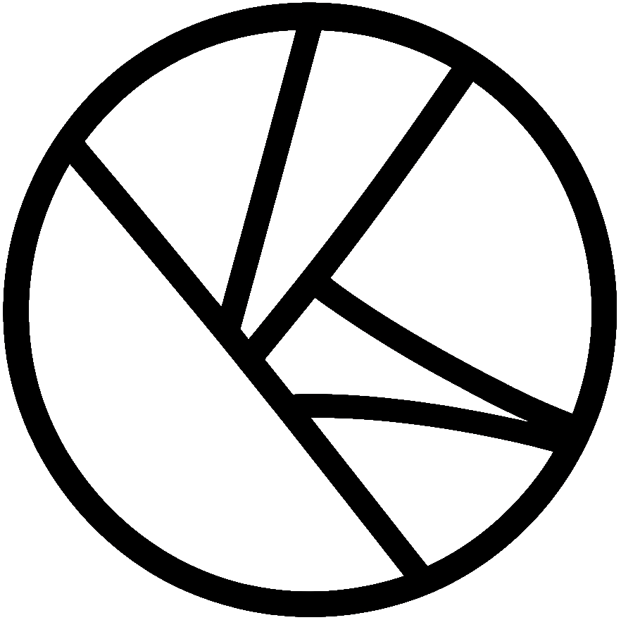

  <picture>
    <source srcset="./assets/oac-inverted-transparent.png" media="(prefers-color-scheme: dark)">
    
  </picture>

 

> Ordered Atomic Collaboration (OAC) is a paradigm for decentralized consequence.

<h1>
  <picture>
    <source srcset="./assets/oac-inverted-transparent.png" media="(prefers-color-scheme: dark)">
    
  </picture>
  Ordered Atomic Collaboration (OAC)
</h1>

WIP! We're renovating this repository!

## Contributing

| Task | Description |
|------|-------------|
| [Upcoming Events](https://github.com/ramate-io/oac/issues?q=is%3Aissue%20state%3Aopen%20label%3Apriority%3Ahigh%2Cpriority%3Amedium%20label%3Aevent) | High-priority `event` issues with planned completion dates. |
| [Release Candidates](https://github.com/ramate-io/oac/issues?q=is%3Aissue%20state%3Aopen%20label%3Arelease-candidate) | Feature-complete versions linked to events. |
| [Features & Bugs](https://github.com/ramate-io/oac/issues?q=is%3Aissue%20state%3Aopen%20label%3Afeature%2Cbug%20label%3Apriority%3Aurgent%2Cpriority%3Ahigh) | High-priority `feature` and `bug` issues. |

Please see [CONTRIBUTING.md](CONTRIBUTING.md) file for additional contribution guidelines.

## Organization

### Artifacts
Under [ROGLO-0](./roglo/roera-000-000-000-dulan/roglo-000-000-000-artifact/README.md), this subsection defines the recognized artifact types. We recognize the following types:
- [`roera`](./roera): OAC Eras (ROERA) are the periods over which a governing body makes decisions. All other OAC [Artifacts](./roglo/roera-000-000-000-dulan/roglo-000-000-000-artifact/README.md) are indexed by ROERA.
- [`roglo`](./roglo/): OAC Glosses (ROGLO) are defined terms for OAC.
- [`roproc`](./opurp/): OAC Proclamations (ROPROC) are statements of purpose for OAC.
- [`rogov`](./rogov/): OAC Governance (ROGOV) are constitutions of, procedures for, and interpretations of OAC governance.
- [`roleg`](./roleg/): OAC Legal Documents (ROLEG) are published legal documents covering OAC operations in any jurisdiction.
- [`rocert`](./rocert/): OAC Certificates (ROCERT) certify a given project as abiding by the OAC paradigm.
- [`rode`](./rode/): OAC Desiderata (RODE) describe wants, open problems, and similar within the OAC paradigm.
- [`rospec`](./rospec): OACSpecifications (OPSEC) describe specifications and are typically written in response to RODE. Generally, contributors should use OPSEC to justify non-trivial changes to this repository.
- [`roart`](./roart/): OAC Articles (ROART) are academic papers which form the conceptual backbone of the OAC paradigm.
- [`roroad`](./roroad/): OAC Roadmaps (ROROAD) are roadmaps describing the intents and objectives of the OAC organization.
- [`rolog`](./rolog/): OAC Logs (ROLOG) are periodically submitted logs describing various developments within the OAC paradigm.
- [`roguide`](./roguide/): OAC Guides (ROGUIDE) are guides or summaries of OAC.
- [`ropre`](./ropre/): OAC Presentations (ROPRE) are presentations about OAC.
- [`rodemo`](./rodemo/): OAC Demonstrations (RODEMO) are selected demonstrations and/or projects built with OAC.

<!--OAC FOOTER: DO NOT REMOVE THIS LINE-->
---

  <a href="https://github.com/ramate-io/oac">
    <picture>
      <source srcset="/assets/oac-inverted-transparent.png" media="(prefers-color-scheme: dark)">
      
    </picture>
  </a>
   
  
    <b>Ordered Atomic Collaboration (OAC)</b>
     
    &copy; 2025 <a href="https://github.com/ramate-io/oac">ramate-io/oac</a>
     
    <a href="https://github.com/ramate-io/oac/blob/main/LICENSE">MIT License</a>
     
    <a href="https://www.ramate.io">ramate.io</a>
  

